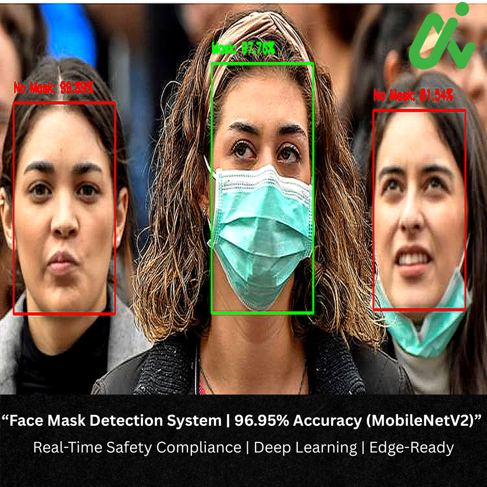

# Face Mask Detection System
## Deep Learning Solution for Real-Time Safety Compliance Monitoring

---

## Executive Summary

This document presents a production-ready **Face Mask Detection System** developed using MobileNetV2 transfer learning architecture. The system achieves **96.95% accuracy** in identifying mask compliance and demonstrates robust performance with **99-100% confidence** on real-world scenarios.

- **Automated Compliance Monitoring**: Reduces manual supervision requirements
- **High Accuracy**: 96.95% accuracy minimizes false positives/negatives
- **Real-Time Processing**: Sub-100ms inference time enables live monitoring
- **Cost-Effective**: Lightweight model (2.4M parameters) suitable for edge deployment

---

## Technical Overview

### System Specifications

| Specification | Value |
|--------------|-------|
| **Model Architecture** | MobileNetV2 (Transfer Learning) |
| **Validation Accuracy** | 96.95% |
| **Training Accuracy** | 98.27% |
| **Inference Time** | <100 milliseconds |
| **Model Size** | 10 MB |
| **Parameters** | 2.4 Million |
| **Input Resolution** | 128×128 pixels |
| **Classes** | 2 (With Mask / Without Mask) |
| **Framework** | TensorFlow 2.x / Keras |

### Performance Metrics

#### Overall Performance
- **Validation Accuracy**: 96.95%
- **Training Accuracy**: 98.27%
- **Precision**: 96.95%
- **Recall**: 96.95%
- **F1-Score**: 96.95%

### Real-World Test Results

The system demonstrates exceptional prediction confidence on actual test cases:

**Test Case 1: Individual Without Mask**
```
Image: without_mask_1.jpg
Prediction: WITHOUT_MASK
Confidence Level: 100.00%
Status: ✓ Verified Correct

Probability Distribution:
  with_mask      :   0.00%
  without_mask   : 100.00% ██████████████████████████
```

**Test Case 2: Individual With Mask**
```
Image: with_mask_1000.jpg
Prediction: WITH_MASK
Confidence Level: 99.99%
Status: ✓ Verified Correct

Probability Distribution:
  with_mask      :  99.99% ██████████████████████████
  without_mask   :   0.01%
```

---

## Model Architecture

### MobileNetV2 Transfer Learning Approach

The system leverages **MobileNetV2**, a state-of-the-art convolutional neural network optimized for mobile and edge devices. This architecture provides an optimal balance between accuracy and computational efficiency.

#### Architecture Design

```
Input Layer (128×128×3 RGB Image)
         ↓
MobileNetV2 Base (Pre-trained on ImageNet)
    • Inverted Residual Blocks
    • Depthwise Separable Convolutions
    • Linear Bottlenecks
         ↓
Global Average Pooling Layer
         ↓
Batch Normalization
         ↓
Dense Layer (256 units, ReLU Activation)
         ↓
Dropout Layer (50% - Regularization)
         ↓
Batch Normalization
         ↓
Dense Layer (128 units, ReLU Activation)
         ↓
Dropout Layer (30% - Regularization)
         ↓
Output Layer (2 units, Softmax Activation)
    → [With Mask, Without Mask]
```


### Dataset Composition

| Metric | Value |
|--------|-------|
| **Total Images** | 7,553 |
| **Training Set** | 6,043 images (80%) |
| **Validation Set** | 1,510 images (20%) |
| **With Mask** | 3,725 images (49.3%) |
| **Without Mask** | 3,828 images (50.7%) |
| **Class Balance** | ✓ Well-balanced |

**Dataset Structure:**
```
face_mask_dataset/
├── with_mask/          # 3,725 images
│   ├── with_mask_0001.jpg
│   ├── with_mask_0002.jpg
│   └── ...
└── without_mask/       # 3,828 images
    ├── without_mask_0001.jpg
    ├── without_mask_0002.jpg
    └── ...
```

### Data Augmentation Pipeline

Comprehensive augmentation strategy to improve model generalization:

| Augmentation Technique | Configuration |
|----------------------|---------------|
| **Rotation** | ±30 degrees |
| **Width Shift** | ±20% |
| **Height Shift** | ±20% |
| **Shear Transformation** | 15% |
| **Zoom Range** | ±20% |
| **Horizontal Flip** | Enabled |
| **Brightness Adjustment** | 80-120% |
| **Fill Mode** | Nearest neighbor |

### Training Configuration

**Optimization Parameters:**
- **Optimizer**: Adam
- **Learning Rate**: 0.0001
- **Loss Function**: Categorical Cross-Entropy
- **Batch Size**: 32
- **Total Epochs**: 25
- **Validation Split**: 20%

